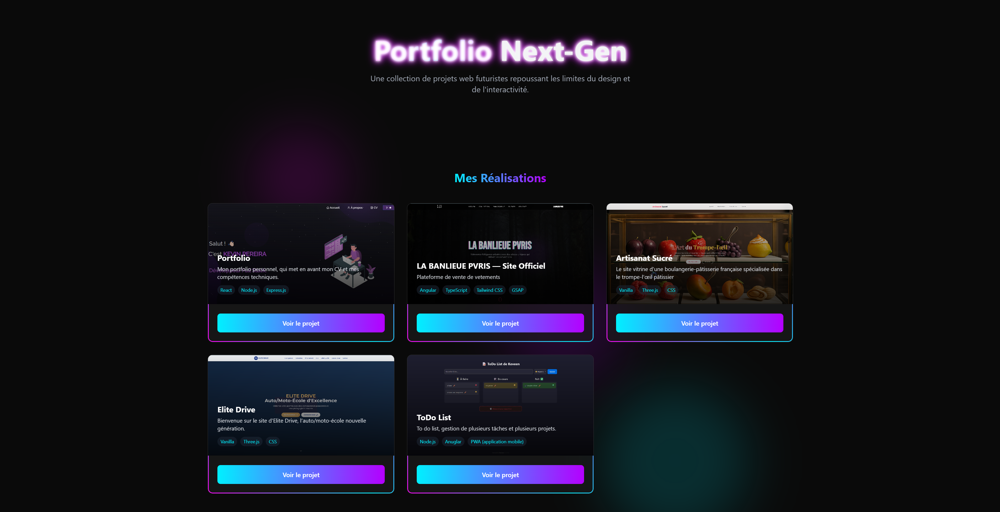

# 🚀 Portfolio Next-Gen

Bienvenue sur mon portfolio ultra moderne !  
Ce site regroupe **tous mes projets web**, dans une interface immersive, animée et responsive.  
Cliquez sur chaque vignette pour découvrir mes réalisations 🚀

---

## ✨ Aperçu

🔗 **Accéder au site en ligne :**  
👉 [https://portfolio-website-psi-flame.vercel.app/](https://portfolio-website-psi-flame.vercel.app/)

---

## 🛠️ Stack technique

- **HTML5 & CSS3**
- **Tailwind CSS** (design, animations et responsive)
- **JavaScript Vanilla** (gestion dynamique des projets)
- **Three.js** (pour les animations ou effets 3D, si besoin d’extensions futures)
- **FontAwesome** (icônes sociaux)
- **Vercel** (déploiement)

---

## 💡 Fonctionnalités

- Interface ultra moderne avec animations néon et effets de flou (glassmorphism)
- Adapté mobile/tablette/desktop
- Projets affichés dynamiquement à partir d’un tableau JS
- Ouverture directe des projets dans un nouvel onglet
- Liens vers **GitHub** et **LinkedIn**
- Code facilement personnalisable pour ajouter de nouveaux projets

---

## 👤 Auteur

**Kevin Pereira**  
[LinkedIn](https://www.linkedin.com/in/pereirak/)  
[GitHub](https://github.com/KevinP93)

---

## ✨ Aperçu

> Une collection de projets web futuristes repoussant les limites du design et de l’interactivité.  
> Interface animée, responsive, effets néon, navigation dynamique… à découvrir !

---

**Merci pour la visite !**  
*N’hésite pas à parcourir mes projets ou à me contacter pour toute collaboration.*
